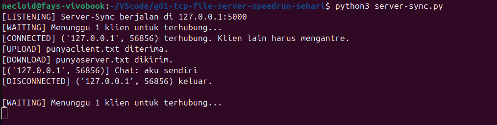
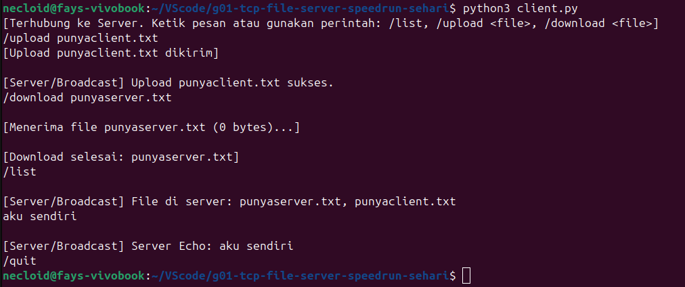
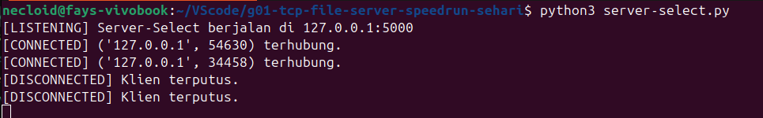
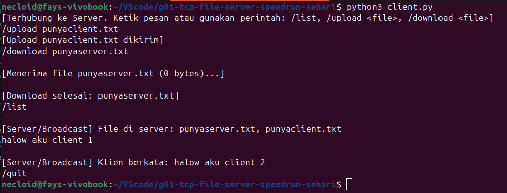
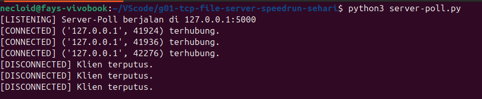
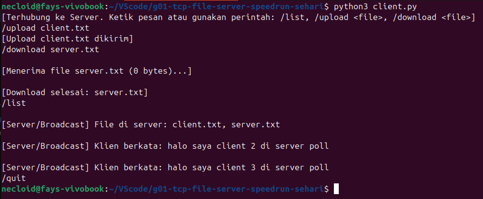
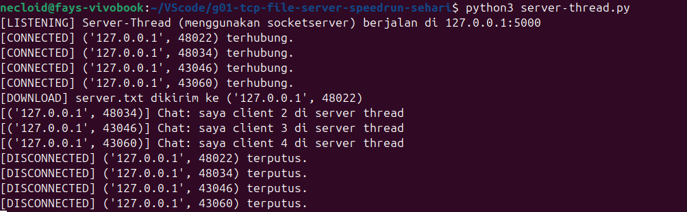
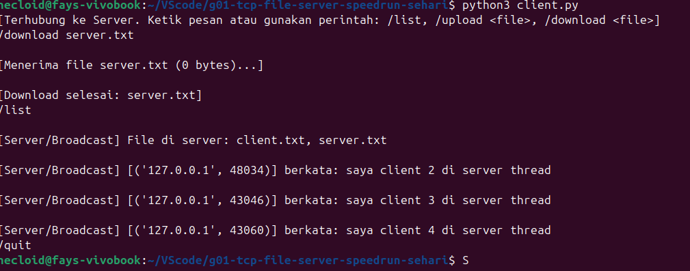

[](https://classroom.github.com/a/mRmkZGKe)
# Network Programming - Assignment G01

## Anggota Kelompok
| Nama           | NRP        | Kelas     |
| ---            | ---        | ----------|
| Erica Triana Widyastuti |5025241069|Pemrograman Jaringan-D|
| Fayza Lathifah Humam         |5025241094|Pemrograman Jaringan-D|

## Link Youtube (Unlisted)
[Link ke Video](https://youtu.be/sHhRsaQhvG8?si=lTuOZTIOEV8noHN4)

## Penjelasan Program
Program ini mengimplementasikan konsep multi-client TCP file server dengan empat pendekatan concurrency berbeda, beserta satu file client universal. Keempat server memiliki fitur yang sama yaitu broadcast chat, list file, upload, dan download, namun berbeda dalam cara tiap server menangani banyak klien secara bersamaan. Berikut adalah penjelasan tiap file:

### 1. server-sync.py
`server_sync.py` adalah implementasi blocking server yang hanya dapat melayani satu klien dalam satu waktu. Server yang di-`accept()` hanya bisa lanjut ke klien berikutnya setelah klien saat ini sudah disconnect. Struktur utama server ini adalah nested loop:

```python
while True:                     
    conn, addr = server.accept()     # block sampai ada klien
    
    while True:                      # melayani klien ini
        data = conn.recv(BUFFER_SIZE)
        if not data: break
        ...
    
    conn.close()                     # baru terima next klien
```

Selama loop dalam berjalan melayani Client 1, server tidak bisa menerima Client 2. Client 2 hanya bisa masuk ke backlog TCP (karena `server.listen(5)`), dan baru mendapat giliran setelah Client 1 disconnect.

### 2. server-select.py
`server-select.py` menggunakan I/O multiplexing melalui `select.select()` untuk menangani banyak klien secara bersamaan tanpa bikin thread atau proses baru, satu thread memonitor semua socket sekaligus dengan`select()`. Server tidak akan block menunggu satu socket tetapi ia hanya memproses socket yang sudah ready. Semua socket aktif disimpan dalam sebuah list:

```python
sockets_list = [server]  # dimulai hanya dengan server socket
```

Setiap iterasi loop, `select.select()` dipanggil dan mengembalikan socket mana yang siap dibaca:

```python
read_sockets, _, exception_sockets = select.select(sockets_list, [], sockets_list)

for notified_socket in read_sockets:
    if notified_socket == server:
        # server socket ready berarti ada klien baru yang mau connect
        client_socket, client_address = server.accept()
        sockets_list.append(client_socket)
    else:
        # client socket ready berarti ada data masuk dari klien ini
        data = notified_socket.recv(BUFFER_SIZE)
        ...
```

Karena semua socket klien tersimpan dalam `sockets_list`, fungsi `broadcast()` bisa mengirim pesan ke semua klien kecuali server socket dan pengirim aslinya:

```python
def broadcast(message, sender_sock, sockets_list):
    for sock in sockets_list:
        if sock != sender_sock and sock.fileno() != -1:
            try:
                sock.sendall(message.encode('utf-8'))
            except:
                pass
```

Pengecekan `sock.fileno() != -1` dilakukan untuk memastikan socket masih valid (belum ditutup). Penggunaan `try/except` pada broadcast mencegah satu klien yang error menyebabkan seluruh broadcast gagal. Kelemahan dari metode ini adalah kompleksitas O(n) dimana setiap panggilan harus scan seluruh list socket, kurang efisien untuk jumlah koneksi yang sangat besar.

### 3. server-poll.py
`server-poll.py` menggunakan `select.poll()` yg merupakan alternatif dari `select` dan lebih efisien untuk banyak koneksi. Fungsionalnya kurang lebih sama dengan `server-select.py`, namun cara kerjanya di tingkat sistem berbeda. Karena `poll` tidak tersedia di Windows, jadi program langsung dihentikan jika di-run di OS yang tidak mendukung:

```python
if not hasattr(select, 'poll'):
    print("Error: OS ini (Windows) tidak mendukung select.poll().")
    sys.exit()
```

`poll` bekerja dengan file descriptor (integer), bukan socket object langsung. Oleh karena itu, dibuat dict untuk memetakan fd ke socket object-nya:

```python
poller = select.poll()
poller.register(server, select.POLLIN)   # daftarkan server socket, watch untuk data masuk
fd_to_socket = {server.fileno(): server} # fd (int) ke socket object
```

Setiap iterasi, `poller.poll()` mengembalikan list tuple `(fd, event)`:

```python
events = poller.poll()
for fd, flag in events:
    sock = fd_to_socket[fd]       # ambil socket dari fd-nya
    if flag & select.POLLIN:
        if sock == server:
            conn, addr = server.accept()
            poller.register(conn, select.POLLIN)
            fd_to_socket[conn.fileno()] = conn
        else:
            data = sock.recv(BUFFER_SIZE)
            ...
```

Saat klien disconnect, socketnya harus unregister dari poller dan dihapus dari dict:

```python
poller.unregister(sock)
del fd_to_socket[fd]
```
Proses upload/download di dalam event loop `poll` bersifat blocking (ada loop `while bytes_received < filesize`) yang bisa memblokir pemrosesan event lain selama transfer file berlangsung, biasanya dapat diatasi dengan non-blocking I/O.

### 4. server-thread.py
`server-thread.py` menggunakan modul `socketserver` bawaan Python dengan `ThreadingMixIn` dimana setiap klien yang connect akan mendapatkan thread-nya sendiri. Ini adalah pendekatan "true concurrency" di mana beberapa klien benar-benar diproses secara paralel. Server dibuat dengan multiple inheritance:

```python
class ThreadedTCPServer(socketserver.ThreadingMixIn, socketserver.TCPServer):
    daemon_threads = True      # thread klien mati otomatis saat server dimatikan
    allow_reuse_address = True # port bisa langsung dipakai ulang setelah restart
```

`ThreadingMixIn` mengubah perilaku `TCPServer` dari synchronous menjadi "spawn thread per request". Main thread-nya tetap berjalan di loop `accept()`, dan setiap kali ada klien baru, framework `socketserver` secara otomatis memanggil tiga method pada `ChatAndFileHandler` untuk setiap klien:
- `setup()`: dipanggil saat klien baru terhubung, di sini socket klien (`self.request`) ditambahkan ke shared `clients` set.
- `handle()`: logika utama yaitu loop `recv()` yang memproses semua command (`CHAT`, `LIST`, `UPLOAD`, `DOWNLOAD`).
- `finish()`: dipanggil otomatis saat klien disconnect (bahkan jika terjadi exception), socket dihapus dari `clients` set.

Variabel `clients` adalah Python `set` yang di-share di antara semua thread:

```python
clients = set()  # diakses oleh semua thread secara bersamaan

class ChatAndFileHandler(socketserver.BaseRequestHandler):
    def setup(self):
        clients.add(self.request)

    def broadcast(self, message):
        for client in list(clients):   # list() untuk snapshot utk menghindari error saat iterasi
            if client != self.request:
                try:
                    client.sendall(message.encode('utf-8'))
                except:
                    pass
```

Penggunaan `list(clients)` saat iterasi penting untuk menghindari `RuntimeError: Set changed size during iteration` karena thread lain bisa saja menambah/menghapus dari `clients` di saat bersamaan. Threading membutuhkan lebih banyak memori (satu thread per klien), namun lebih responsif untuk operasi yang memakan waktu.


### 5. client.py
`client.py` adalah terminal client yang dapat bekerja dengan keempat variasi server yang sudah dibahas sebelumnya dengan memisahkan dua tanggung jawab ke dalam dua thread berbeda. Satu thread untuk menerima pesan dari server (berjalan di background), dan satu thread utama untuk membaca input dari user. Seperti berikut:

```python
# Thread background untuk menerima pesan
threading.Thread(target=receive_messages, args=(sock,), daemon=True).start()

# Thread utama untuk mengirim input user
while True:
    msg = input("")
    ...
```

Thread penerima dibuat sebagai daemon thread (`daemon=True`) yang akan otomatis mati ketika program utama selesai. Semua komunikasi antara client dan server menggunakan delimiter-based framing dengan karakter `|` sebagai pemisah (sesuai Method 4: Delimiter dari materi PPT). Format pesannya adalah sebagai berikut:

| Pesan | Format |
|---|---|
| Chat biasa | `CHAT\|isi pesan` |
| Notifikasi file masuk | `FILE\|namafile\|ukuran_bytes` |
| Minta daftar file | `LIST\|` |
| Upload file | `UPLOAD\|namafile\|ukuran_bytes` |
| Download file | `DOWNLOAD\|namafile` |

Untuk transfer file, client mengirim header terlebih dahulu (`UPLOAD|nama|ukuran`), lalu langsung mengirim byte file tersebut setelahnya. Di sisi penerima, ukuran file dari header digunakan untuk menentukan berapa byte yang harus dibaca, melalui kombinasi antara delimiter (untuk header) dan length-prefix (untuk body file).

## Screenshot Hasil
### Hasil server-sync.py
#### Server: 
#### Client: 

### Hasil server-select.py
#### Server: 
#### Client: 

### Hasil server-poll.py
#### Server: 
#### Client: 

### Hasil server-thread.py
#### Server: 
#### Client: 
